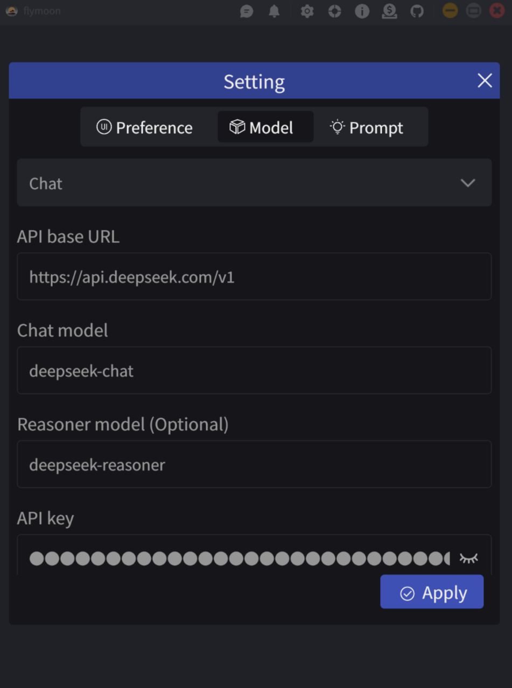

    
    
    
    
    
    

[中文文档](./README.zh-CN.md)

### Introduction
This is a large language model chat client built with Rust and Slint GUI, compatible with OpenAI's API.

- [x] Supports both chat and deep thinking modes
- [x] Supports online Google search
- [x] Automatically saves chat history
- [x] Customizable system prompts
- [ ] Supports MCP

### How to build?
- Install `Rust`, `Cargo`, `cargo-apk` and `wasm-pack`
- Run `make desktop-debug` to run it on desktop platform
- Run `make desktop-build-release` to build a release version desktop application
- Refer to [Makefile](./Makefile) for more information

### Reference
- [Slint Language Documentation](https://slint-ui.com/releases/1.0.0/docs/slint/)
- [slint::android](https://snapshots.slint.dev/master/docs/rust/slint/android/#building-and-deploying)
- [Running In A Browser Using WebAssembly](https://releases.slint.dev/1.7.0/docs/slint/src/quickstart/running_in_a_browser)
- [github/slint-ui](https://github.com/slint-ui/slint)
- [Viewer for Slint](https://github.com/slint-ui/slint/tree/master/tools/viewer)
- [LSP (Language Server Protocol) Server for Slint](https://github.com/slint-ui/slint/tree/master/tools/lsp)
- [developer.android.com](https://developer.android.com/guide)
- [color4bg](https://www.color4bg.com/zh-hans/)
- [How to Deploy Rust Binaries with GitHub Actions](https://dzfrias.dev/blog/deploy-rust-cross-platform-github-actions/)
