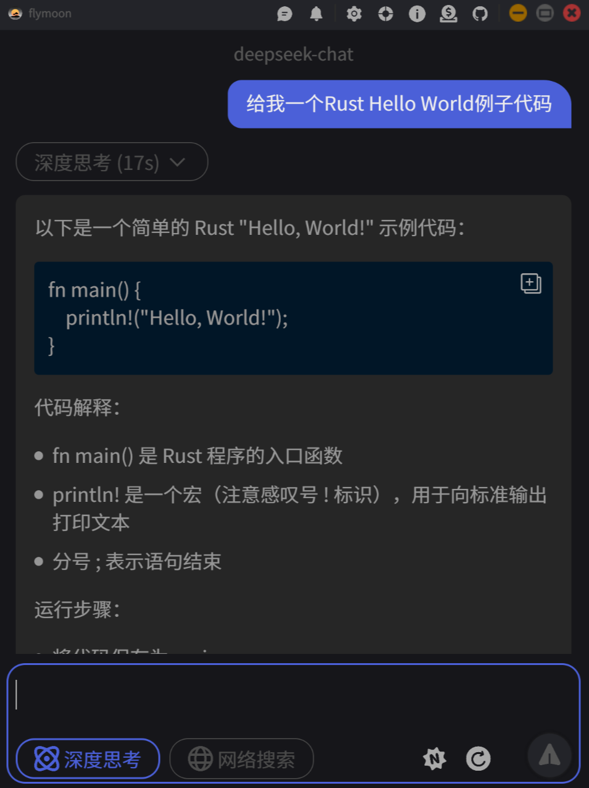
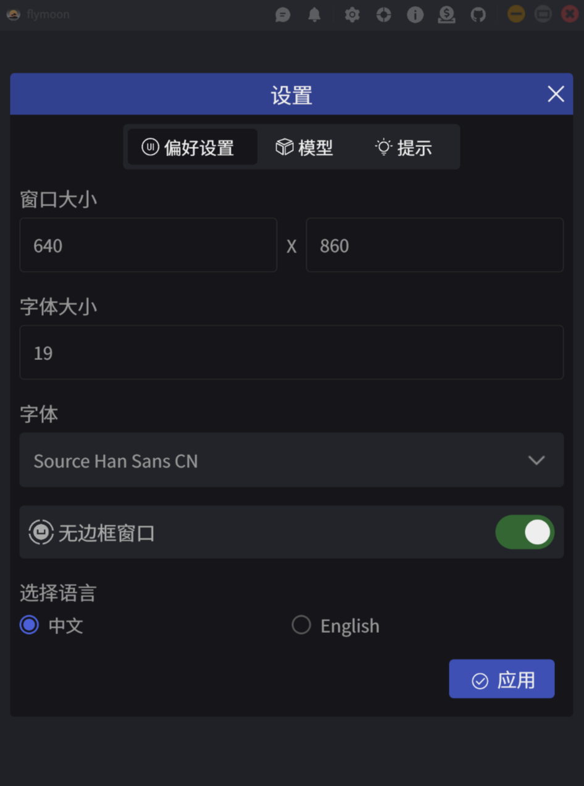
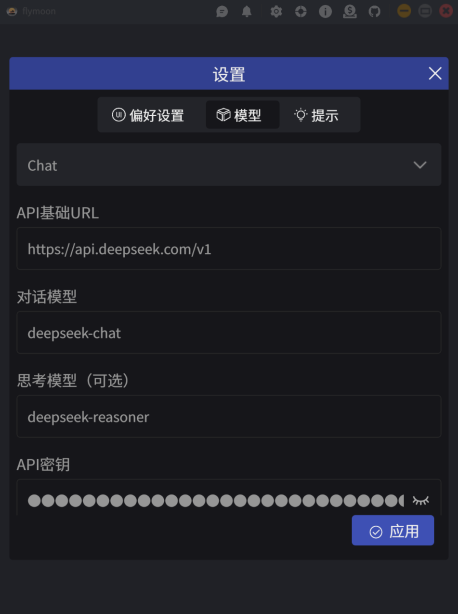
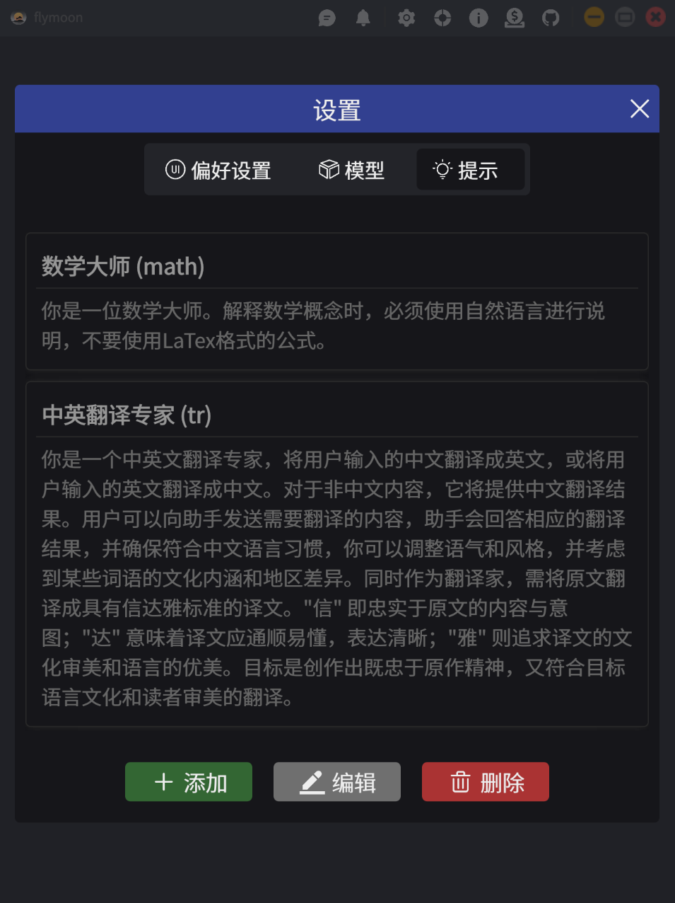

<!-- 
 -->
<!--      -->
<!--      -->
<!--      -->
<!--      -->
<!--      -->
<!--      -->
<!--      -->
<!-- 
 -->

[English Documentation](./README.md)

### 简介
这是一个基于Rust和Slint-ui的极简聊天程序。

### 如何构建?
- 安装 `Rust` 和 `Cargo`
- 运行 `make desktop-debug` 调试桌面平台程序
- 运行 `make desktop-build-release` 编译桌面平台程序
- 参考 [Makefile](./Makefile) 了解更多信息

### 参考
- [Slint Language Documentation](https://slint-ui.com/releases/1.0.0/docs/slint/)
- [slint::android](https://snapshots.slint.dev/master/docs/rust/slint/android/#building-and-deploying)
- [Running In A Browser Using WebAssembly](https://releases.slint.dev/1.7.0/docs/slint/src/quickstart/running_in_a_browser)
- [github/slint-ui](https://github.com/slint-ui/slint)
- [Viewer for Slint](https://github.com/slint-ui/slint/tree/master/tools/viewer)
- [LSP (Language Server Protocol) Server for Slint](https://github.com/slint-ui/slint/tree/master/tools/lsp)
- [developer.android.com](https://developer.android.com/guide)
- [color4bg](https://www.color4bg.com/zh-hans/)
- [How to Deploy Rust Binaries with GitHub Actions](https://dzfrias.dev/blog/deploy-rust-cross-platform-github-actions/)
